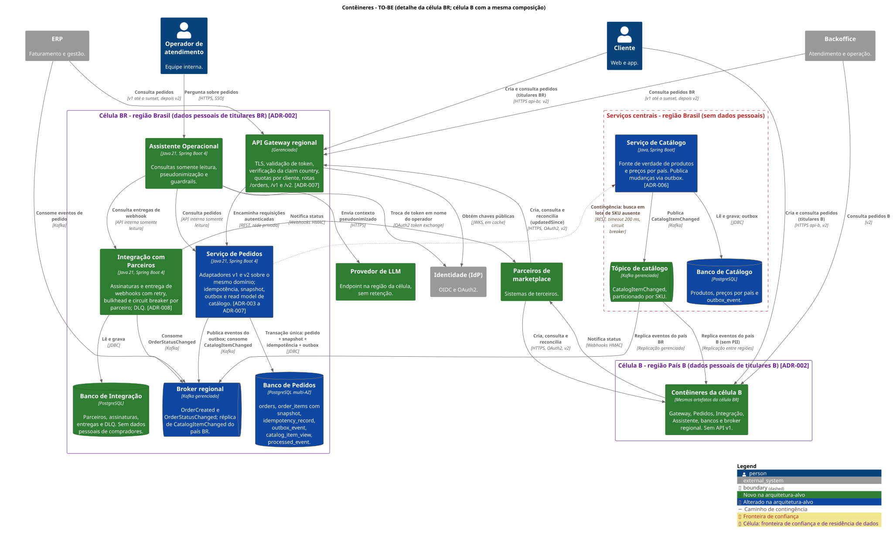

# Evolução arquitetural: plataforma de Pedidos e Catálogo

[](https://github.com/regisan/marketplace/actions/workflows/governanca.yml)
[](https://github.com/regisan/marketplace/actions/workflows/diagramas.yml)
[](https://github.com/regisan/marketplace/actions/workflows/poc.yml)

Proposta de evolução da plataforma de Pedidos e Catálogo para suportar, em 90 dias, aplicativo móvel, parceiros de marketplace e operação em um segundo país, com volume 10 vezes maior, sem interromper os consumidores atuais. Inclui decisões arquiteturais, diagramas como código, contratos versionados, plano incremental e uma prova de conceito executável em Java 21 e Spring Boot.

> **Para uma leitura rápida:** comece pelo [resumo executivo](RESUMO-EXECUTIVO.md) e pela [visão da arquitetura](docs/arquitetura/README.md). Para ver a prova funcionando, vá direto para [Como executar a PoC](#como-executar-a-poc).

## Recomendação em resumo

| Problema atual | Decisão | ADR |
|---|---|---|
| Pedidos consulta o Catálogo uma vez por item (N+1 síncrono) | Read model local de catálogo, alimentado por eventos; Catálogo fora do caminho crítico | [ADR-003](docs/adr/ADR-003-read-model-local-de-catalogo.md) |
| Preço e descrição sem snapshot | Snapshot imutável no item do pedido | [ADR-004](docs/adr/ADR-004-snapshot-de-item-do-pedido.md) |
| Retries sem chave de idempotência | `Idempotency-Key` com restrição única na mesma transação do pedido | [ADR-005](docs/adr/ADR-005-idempotencia-na-criacao-de-pedido.md) |
| Eventos publicados sem garantia transacional | Transactional outbox com entrega pelo menos uma vez e deduplicação | [ADR-006](docs/adr/ADR-006-transactional-outbox.md) |
| Parceiros pedem API versionada; contratos atuais por 6 meses | v1 e v2 como adaptadores do mesmo domínio; evolução apenas aditiva | [ADR-007](docs/adr/ADR-007-versionamento-de-api-e-compatibilidade.md) |
| Parceiros pedem notificações assíncronas | Webhooks assinados com HMAC, isolamento por parceiro e reconciliação | [ADR-008](docs/adr/ADR-008-notificacao-a-parceiros-por-webhooks.md) |
| LGPD e residência de dados no segundo país | Célula por país para tudo que contém dados pessoais | [ADR-002](docs/adr/ADR-002-celula-por-pais-para-residencia-de-dados.md) |
| Prazo curto e equipe pequena | Evoluir os serviços existentes; um único serviço novo | [ADR-001](docs/adr/ADR-001-evolucao-incremental-sobre-servicos-existentes.md) |

## Arquitetura-alvo



Diagramas de contexto e contêineres (AS-IS e TO-BE), diagramas de sequência, pontos de falha, fronteiras de confiança e dependências externas estão em [docs/arquitetura](docs/arquitetura/README.md).

## Como executar a PoC

A fatia executável prova a decisão crítica do desafio: **chamadas repetidas com a mesma chave não criam pedidos duplicados, inclusive em concorrência, e a evolução do contrato não quebra o consumidor atual**, demonstrado por um teste escrito apenas contra o contrato v1 original.

**Pré-requisitos:** Java 21 e Docker em execução.

```bash
cd poc
./mvnw verify
```

O comando sobe o PostgreSQL com Testcontainers, aplica as migrações e os dados sintéticos e executa os testes positivos e negativos de idempotência, compatibilidade, contrato, snapshot, evento e segurança, além das regras de arquitetura. O mesmo comando roda no CI a cada mudança em `poc/`.

Detalhes, mapa de testes por cenário, simplificações e execução manual: [poc/README.md](poc/README.md).

## Índice de artefatos

| Artefato | Local |
|---|---|
| Resumo executivo | [RESUMO-EXECUTIVO.md](RESUMO-EXECUTIVO.md) |
| Premissas, interpretações do enunciado e questões abertas | [docs/00-premissas-e-questoes-abertas.md](docs/00-premissas-e-questoes-abertas.md) |
| Mapa de domínios: bounded contexts, ownership, linguagem ubíqua, integrações | [docs/01-mapa-de-dominios.md](docs/01-mapa-de-dominios.md) |
| Atributos de qualidade: metas, mecanismos e cenários com critérios de aceite | [docs/02-atributos-de-qualidade.md](docs/02-atributos-de-qualidade.md) |
| Resiliência e prevenção de efeito cascata | [docs/03-resiliencia.md](docs/03-resiliencia.md) |
| Threat model e LGPD | [docs/04-threat-model.md](docs/04-threat-model.md) |
| Plano incremental 30/60/90 | [docs/05-plano-30-60-90.md](docs/05-plano-30-60-90.md) |
| Riscos, débitos aceitos e fora do escopo | [docs/06-riscos-e-fora-de-escopo.md](docs/06-riscos-e-fora-de-escopo.md) |
| Estimativa de esforço, equipe e custos | [docs/07-estimativa.md](docs/07-estimativa.md) |
| ADRs | [docs/adr](docs/adr/README.md) |
| Diagramas C4 e de sequência | [docs/arquitetura](docs/arquitetura/README.md) |
| Contratos OpenAPI e AsyncAPI | [poc/docs](poc/docs/README.md) |
| Prova de conceito | [poc](poc/README.md) |
| Governança: política de contratos, exceções, fitness functions | [docs/governanca](docs/governanca/README.md) |
| Capacidade de IA: Assistente Operacional | [docs/ia/assistente-de-pedidos.md](docs/ia/assistente-de-pedidos.md) |
| Uso de IA na elaboração da proposta | [docs/ia/uso-de-ia-na-proposta.md](docs/ia/uso-de-ia-na-proposta.md) |

### Ordem de leitura sugerida

1. Resumo executivo
2. Premissas: o enunciado não traz volumes, o segundo país nem o contrato atual; todas as lacunas estão explicitadas ali
3. Mapa de domínios e ADRs
4. Arquitetura (diagramas)
5. Atributos de qualidade, resiliência e threat model
6. Plano, riscos e estimativa
7. Contratos e PoC

## Rastreabilidade: requisito do enunciado → artefato

| Requisito | Onde é atendido |
|---|---|
| Diagramas C4 de contexto e contêineres, AS-IS e TO-BE | [docs/arquitetura/c4](docs/arquitetura/README.md) |
| Diagramas de sequência: criação de pedido e atualização/notificação de status | [docs/arquitetura/sequencia](docs/arquitetura/README.md) |
| Componentes, dependências externas, fronteiras de confiança e pontos de falha | [docs/arquitetura/README.md](docs/arquitetura/README.md) |
| Atributos de qualidade relacionados aos mecanismos | [02-atributos-de-qualidade.md, seção 2](docs/02-atributos-de-qualidade.md) |
| Bounded contexts, responsabilidades, ownership e linguagem de domínio | [01-mapa-de-dominios.md](docs/01-mapa-de-dominios.md) |
| Integração síncrona ou assíncrona, com justificativa | [01-mapa-de-dominios.md, seção 6](docs/01-mapa-de-dominios.md); ADR-003, ADR-006, ADR-008 |
| Snapshot de preço, idempotência, publicação confiável, deduplicação e reconciliação | ADR-004, ADR-005, ADR-006, ADR-003 e ADR-008 |
| APIs públicas: autenticação, autorização, quotas e versionamento | [ADR-007](docs/adr/ADR-007-versionamento-de-api-e-compatibilidade.md), [orders-v2.yaml](poc/docs/openapi/orders-v2.yaml), [threat model](docs/04-threat-model.md) |
| Mínimo de quatro ADRs | [Oito ADRs](docs/adr/README.md) |
| Plano 30/60/90 com convivência, observabilidade, rollback e descomissionamento | [05-plano-30-60-90.md](docs/05-plano-30-60-90.md) |
| Cenários de disponibilidade, performance, segurança, auditabilidade e recuperação | [02-atributos-de-qualidade.md, seção 3](docs/02-atributos-de-qualidade.md) |
| Threat model: identidade, APIs públicas, dados, eventos e dependências | [04-threat-model.md](docs/04-threat-model.md) |
| Timeout, retry com backoff, circuit breaker, bulkhead e degradação controlada | [03-resiliencia.md](docs/03-resiliencia.md) |
| Riscos, premissas, débitos aceitos e itens fora do escopo | [06-riscos-e-fora-de-escopo.md](docs/06-riscos-e-fora-de-escopo.md), [00-premissas](docs/00-premissas-e-questoes-abertas.md) |
| OpenAPI de criação e consulta; AsyncAPI de mudança de status | [poc/docs](poc/docs/README.md) |
| Prova mínima de decisão crítica com testes positivos e negativos no pipeline | [poc](poc/README.md), workflow `poc.yml` |
| Dados sintéticos e comando único documentado | [Como executar a PoC](#como-executar-a-poc) |
| Capacidade de IA com isolamento, minimização, guardrails, observabilidade e avaliação | [assistente-de-pedidos.md](docs/ia/assistente-de-pedidos.md) |
| Validações de OpenAPI/AsyncAPI, ADRs e regras arquiteturais no CI | [fitness-functions.md](docs/governanca/fitness-functions.md) |
| Política de evolução de contratos e processo leve de exceção | [docs/governanca](docs/governanca/README.md) |
| Estimativa da primeira fase | [07-estimativa.md](docs/07-estimativa.md) |
| Documento sobre a ferramenta de IA utilizada, prompts e validações | [uso-de-ia-na-proposta.md](docs/ia/uso-de-ia-na-proposta.md) |

## Premissas principais

O enunciado não informa volumes atuais, o segundo país, a stack atual nem o contrato existente. A proposta adota premissas explícitas e mostra o impacto de cada uma estar errada. As mais relevantes:

- Volume atual de 100 mil pedidos por dia, com meta de 260 pedidos por segundo no pico projetado.
- O segundo país ("País B") exige que dados pessoais de seus titulares fiquem em seu território.
- Pedidos e Catálogo são serviços separados com bancos próprios, e já existe um broker em produção.
- O contrato atual da API foi reconstruído a partir do enunciado e serve de linha de base de compatibilidade.

Lista completa, interpretações de pontos ambíguos do enunciado e questões para o cliente: [docs/00-premissas-e-questoes-abertas.md](docs/00-premissas-e-questoes-abertas.md).

## Integração contínua

| Workflow | O que verifica |
|---|---|
| `governanca.yml` | Lint dos contratos com regras próprias (sem dados pessoais em eventos, idempotência obrigatória na v2, erros padronizados), validação do AsyncAPI, detecção de quebra de contrato com `oasdiff`, estrutura dos ADRs, exceções vencidas e links da documentação |
| `diagramas.yml` | Sintaxe dos diagramas PlantUML e geração dos SVGs |
| `poc.yml` | Build e testes da PoC, análise de dependências e análise estática |

O catálogo completo de fitness functions está em [docs/governanca/fitness-functions.md](docs/governanca/fitness-functions.md).

## Estrutura do repositório

```
.
├── README.md
├── RESUMO-EXECUTIVO.md
├── CLAUDE.md                      # instruções para o Claude Code
├── docs/
│   ├── 00-premissas-e-questoes-abertas.md
│   ├── 01-mapa-de-dominios.md
│   ├── 02-atributos-de-qualidade.md
│   ├── 03-resiliencia.md
│   ├── 04-threat-model.md
│   ├── 05-plano-30-60-90.md
│   ├── 06-riscos-e-fora-de-escopo.md
│   ├── 07-estimativa.md
│   ├── adr/                       # ADR-001 a ADR-008
│   ├── arquitetura/               # C4 e sequência em PlantUML, com SVGs gerados
│   ├── governanca/                # política de contratos, exceções, fitness functions
│   └── ia/                        # Assistente Operacional e uso de IA na proposta
├── poc/
│   ├── CLAUDE.md                  # especificação da PoC
│   ├── docs/                      # contratos OpenAPI e AsyncAPI, regras Spectral
│   └── ...                        # projeto Maven (Java 21, Spring Boot)
├── scripts/                       # renderização de diagramas e verificações de governança
└── .github/                       # workflows, template de PR, CODEOWNERS
```

## Uso de IA

A proposta foi elaborada com apoio de IA: o Claude (claude.ai) na análise do enunciado, na redação dos documentos e na revisão cruzada entre artefatos, e o Claude Code na implementação da PoC, a partir de uma especificação escrita antes do código. Prompts relevantes, decisões, correções feitas sobre as saídas e cuidados com dados estão em [docs/ia/uso-de-ia-na-proposta.md](docs/ia/uso-de-ia-na-proposta.md).
