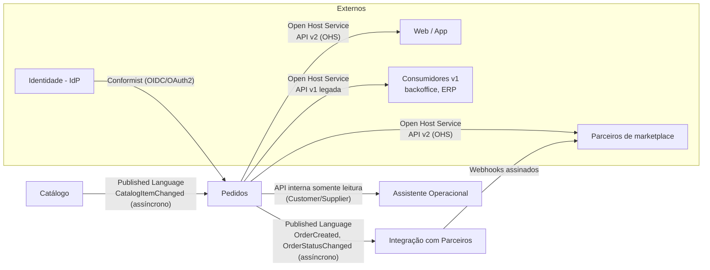
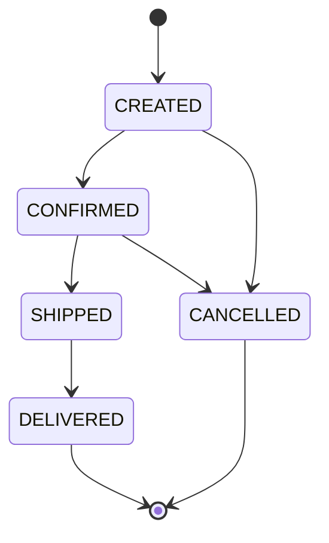

# Mapa de domínios

> Define os bounded contexts, o dono de cada dado, a linguagem ubíqua e o estilo de integração entre contextos. Os ADRs, diagramas C4, contratos e o código da PoC usam exclusivamente os termos deste documento.
>
> Premissas de base: P-DOM-01 a P-DOM-07, P-PAIS-03 e P-PAIS-04 (`00-premissas-e-questoes-abertas.md`).

## 1. Bounded contexts

| Contexto | Classificação | Responsabilidade | Não é responsável por |
|---|---|---|---|
| **Pedidos** | Core | Aceitar, validar e registrar pedidos; manter o snapshot dos itens; controlar o ciclo de vida do status; garantir idempotência; publicar eventos de pedido | Definir preço vigente, cadastrar produtos, entregar notificações a terceiros |
| **Catálogo** | Suporte | Manter produtos, SKUs, descrições e preço vigente por país; publicar mudanças | Saber em quais pedidos um produto foi vendido |
| **Integração com Parceiros** | Suporte | Cadastro de parceiros e de assinaturas de webhook; entrega confiável de notificações; reconciliação com parceiros | Decidir status de pedido ou guardar dados pessoais de clientes |
| **Assistente Operacional** | Genérico (IA) | Responder consultas de atendimento e operação sobre pedidos, somente leitura | Alterar qualquer dado; acessar bancos diretamente |

**Sistemas externos, fora do escopo** (P-DOM-02): Identidade (IdP), Pagamento, Estoque, Frete, Fiscal, Backoffice e ERP. Aparecem no C4 como dependências externas.

**Infraestrutura, não contexto de domínio:** API Gateway (roteamento, autenticação, quotas, versionamento de rota) e broker de mensageria.

## 2. Mapa de contexto

| Relação | Padrão | Observação |
|---|---|---|
| Catálogo → Pedidos | Published Language + Anticorruption Layer em Pedidos | Pedidos traduz `CatalogItemChanged` para seu próprio modelo (`CatalogItemView`); não usa o modelo interno do Catálogo |
| Pedidos → Integração com Parceiros | Published Language | Integração consome eventos sem PII e nunca escreve em Pedidos |
| Pedidos → clientes e parceiros | Open Host Service versionado | v1 mantida por compatibilidade (ADR-007), v2 é a API pública |
| IdP → todos | Conformist | A plataforma adota os tokens e claims do IdP sem tradução |
| Pedidos → Assistente | Customer/Supplier | Assistente consome API interna dedicada, com escopo e campos mínimos |

## 3. Ownership de dados

| Dado | Dono (escrita) | Quem lê | Como lê | Consistência aceita |
|---|---|---|---|---|
| Produto, SKU, descrição, preço vigente | Catálogo | Pedidos | Read model local alimentado por eventos | Eventual, P95 ≤ 5 s (P-SLO-05) |
| Pedido, itens, snapshot do item | Pedidos | Clientes, parceiros, backoffice, Assistente | API (v1, v2, interna) | Forte para quem cria; leitura própria imediata |
| Status do pedido e histórico de transições | Pedidos | Integração com Parceiros, clientes | Eventos e API | Eventual para notificações (P-SLO-04) |
| Registro de idempotência | Pedidos | Somente Pedidos | Interno | Forte (mesma transação do pedido) |
| Dados pessoais do comprador (nome, contato, endereço) | Pedidos | Cliente dono, backoffice autorizado | API com autorização | Forte; nunca trafegam em eventos |
| Parceiro, assinatura de webhook, segredo | Integração com Parceiros | Gateway (quotas), Integração | Configuração e API interna | Forte |
| Entregas de webhook e tentativas | Integração com Parceiros | Backoffice | API interna | Eventual |
| Credenciais e identidades | IdP (externo) | Gateway e serviços | Tokens | Definida pelo IdP |

**Dados pessoais** existem apenas em Pedidos e, por célula, permanecem no país do titular (ADR-002). Catálogo e Integração com Parceiros não armazenam dados pessoais de compradores.

## 4. Linguagem ubíqua

Documentação em português; código, contratos e eventos em inglês. A tabela é a referência de tradução.

| Termo | Nome no código e contratos | Definição |
|---|---|---|
| Pedido | `Order` | Intenção de compra aceita pela plataforma, pertencente a um único país e uma única célula |
| Item do pedido | `OrderItem` | Linha do pedido com SKU, quantidade e snapshot |
| Snapshot do item | `ItemSnapshot` | Cópia imutável de preço, moeda, descrição e versão de catálogo no momento da criação |
| Preço vigente | `CatalogPrice` | Preço atual de um SKU em um país, definido pelo Catálogo |
| Preço praticado | `ItemSnapshot.unitPrice` | Preço efetivamente cobrado no pedido; não muda após a criação |
| Versão de catálogo | `catalogVersion` | Número monotônico por SKU, incrementado a cada mudança no Catálogo |
| Visão de catálogo | `CatalogItemView` | Read model local, em Pedidos, com os dados de catálogo necessários para validar e precificar itens |
| Status do pedido | `OrderStatus` | `CREATED`, `CONFIRMED`, `SHIPPED`, `DELIVERED`, `CANCELLED` |
| Transição de status | `StatusTransition` | Mudança de um status para outro, com data e origem; o histórico é imutável |
| Versão do pedido | `Order.version` | Número monotônico incrementado a cada transição; usado para ordenar eventos |
| Canal de origem | `channel` | `WEB`, `APP`, `PARTNER`, `LEGACY_V1` |
| Parceiro | `Partner` | Marketplace autenticado por *client credentials*, com quotas e escopos próprios |
| Referência externa | `externalReference` | Identificador do pedido no sistema do parceiro; único por parceiro |
| Chave de idempotência | `Idempotency-Key` | Identificador enviado pelo chamador para tornar a criação segura contra repetição |
| Assinatura de webhook | `WebhookSubscription` | URL, segredo e tipos de evento que um parceiro deseja receber |
| Entrega | `WebhookDelivery` | Tentativa de envio de uma notificação a um parceiro, com resultado |
| Célula | `Cell` (`BR`, `B`) | Implantação isolada por país que contém os dados pessoais daquele país |

## 5. Invariantes do agregado Pedido

1. Todo pedido pertence a exatamente um país e é armazenado apenas na célula desse país.
2. Itens e snapshots são imutáveis após a criação.
3. Transições de status seguem a máquina de estados; não há retorno a estado anterior, e `CANCELLED` e `DELIVERED` são finais.
4. Cada transição incrementa `Order.version` e gera exatamente um evento no outbox, na mesma transação.
5. Para um mesmo par (chamador, `Idempotency-Key`) existe no máximo um pedido.
6. Para um mesmo par (parceiro, `externalReference`) existe no máximo um pedido.

## 6. Estilo de integração

| Integração | Estilo | Justificativa | ADR |
|---|---|---|---|
| Criação de pedido (cliente/parceiro → Pedidos) | Síncrona | O chamador precisa do resultado e do identificador para continuar | ADR-005, ADR-007 |
| Pedidos → dados de Catálogo durante a criação | Leitura local (sem chamada) | Elimina N+1 e retira o Catálogo do caminho crítico (C-01 a C-03) | ADR-003 |
| Catálogo → Pedidos (mudanças de produto e preço) | Assíncrona | Tolerância a atraso de segundos; desacopla disponibilidade | ADR-003, ADR-006 |
| Pedidos → Integração com Parceiros | Assíncrona | Notificação não pode bloquear nem derrubar a criação de pedido | ADR-006, ADR-008 |
| Integração com Parceiros → parceiro | Assíncrona (webhook) | Parceiros pedem notificação ativa; falha de parceiro fica isolada | ADR-008 |
| Parceiro → consulta e reconciliação | Síncrona | Leitura por chave ou por intervalo, sem dependências | ADR-008 |
| Assistente → Pedidos | Síncrona, somente leitura | Consulta pontual com autorização do operador | Documento de IA |
| Pedidos → Pagamento, Estoque, Frete | Fora do escopo | A definir quando esses contextos forem integrados (P-DOM-02) | — |
