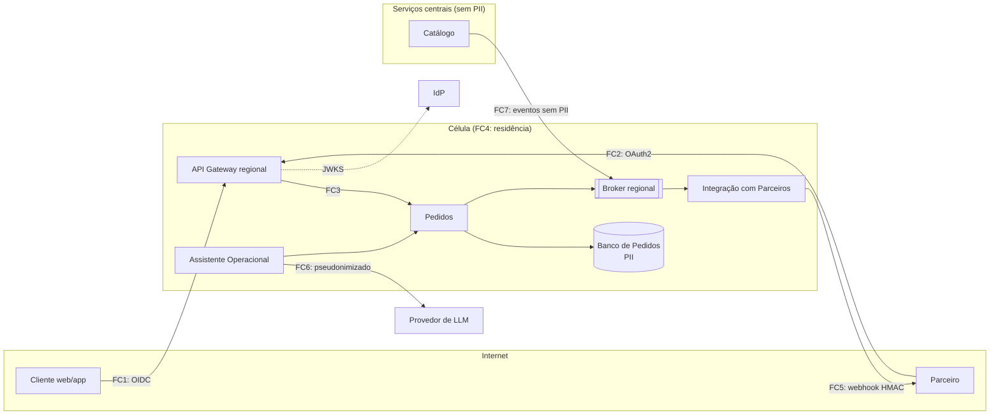

# Threat model simplificado

> Identifica as principais ameaças à arquitetura-alvo nas cinco áreas pedidas no enunciado (identidade, APIs públicas, dados, eventos e dependências), mais a capacidade de IA, e os controles que as tratam. Usa as fronteiras de confiança FC1 a FC7 definidas em `arquitetura/README.md`.
>
> Base: ADR-002, ADR-005, ADR-007, ADR-008; contratos em `poc/docs/`; cenários QA-SEG e QA-PRI em `02-atributos-de-qualidade.md`.

## 1. Método

- **Modelo:** STRIDE aplicado a cada fronteira de confiança e a cada fluxo de dados que a cruza. S = falsificação de identidade, T = adulteração, R = repúdio, I = divulgação de informação, D = negação de serviço, E = elevação de privilégio.
- **Classificação de risco:** probabilidade (baixa, média, alta) × impacto (baixo, médio, alto), resumida em **Alto**, **Médio** ou **Baixo**. O risco inerente considera a arquitetura sem o controle; o residual, com os controles propostos.
- **Simplificação deliberada:** o foco são as ameaças específicas desta arquitetura. Controles básicos de qualquer sistema (TLS em todas as conexões, criptografia em repouso, patching, hardening de contêineres) são assumidos e listados apenas na seção 6.
- **Revisão:** a cada ADR novo ou mudança de fronteira, e no mínimo a cada trimestre.

## 2. Ativos

| Ativo | Onde está | Propriedade crítica |
|---|---|---|
| Dados pessoais de compradores (nome, e-mail) | Banco de Pedidos de cada célula | Confidencialidade, residência |
| Pedidos, snapshots e histórico de status | Banco de Pedidos | Integridade, disponibilidade |
| Preços vigentes | Catálogo central e read models | Integridade |
| Credenciais de parceiros (*client secrets*) | IdP | Confidencialidade |
| Segredos HMAC de webhook | Cofre de segredos, por célula | Confidencialidade |
| Eventos de pedido e de catálogo | Brokers | Integridade, ausência de PII |
| Logs, métricas e traces | Plataforma de observabilidade | Ausência de PII e segredos |
| Contexto enviado ao LLM | Assistente Operacional, provedor de LLM | Confidencialidade, residência |
| Pipeline de CI/CD e artefatos | Repositório e registro de imagens | Integridade |

## 3. Atores de ameaça

| Ator | Motivação típica | Ponto de entrada |
|---|---|---|
| Atacante externo anônimo | Indisponibilidade, coleta de dados, fraude | FC1, FC2 |
| Cliente autenticado mal-intencionado | Acessar pedidos de outros, manipular preço | FC1 |
| Parceiro comprometido ou mal-intencionado | Acessar pedidos de outros parceiros, abuso de volume, SSRF via webhook | FC2, FC5 |
| Operador interno (insider) | Consulta indevida de dados pessoais, alteração de registros | Backoffice, Assistente, acesso a produção |
| Dependência comprometida | Execução de código ou dados adulterados | Bibliotecas, Catálogo, provedores |
| Conteúdo malicioso em dados | *Prompt injection* no Assistente | Campos de texto de pedidos e produtos |

## 4. Fluxo de dados e fronteiras

## 5. Ameaças e controles

### 5.1 Identidade

| ID | STRIDE | Ameaça | Fronteira | Risco inerente | Controles | Residual | Verificação |
|---|---|---|---|---|---|---|---|
| ID-01 | S | *Client secret* de parceiro vazado permite criar e consultar pedidos em nome dele | FC2 | Alto | Tokens de curta duração (15 min); escopos mínimos; quotas por parceiro; alerta de anomalia de volume e de origem; rotação de segredo sem indisponibilidade; `private_key_jwt` ou mTLS como opção para parceiros de maior volume | Médio | QA-SEG-05, QA-ESC-05 |
| ID-02 | S | Token forjado, expirado ou emitido para outra aplicação aceito pela API | FC1, FC2 | Alto | Validação de assinatura com lista fechada de algoritmos (nunca `none`), `iss`, `aud`, `exp` e `nbf`, no gateway e novamente em Pedidos | Baixo | Testes de API com tokens inválidos |
| ID-03 | S | Token emitido para uma célula usado em outra | FC1, FC2 | Médio | Gateway regional rejeita tokens cuja claim `country` não corresponde à célula (ADR-002) | Baixo | QA-SEG-02 |
| ID-04 | E | Token de cliente final usado para operações de parceiro ou de backoffice | FC3 | Alto | Escopos distintos por tipo de cliente; autorização por recurso em Pedidos, não apenas no gateway; API de transições disponível só na rede interna | Baixo | QA-SEG-05 |
| ID-05 | I | Segredo de cliente embutido no app móvel | FC1 | Alto | App usa OIDC *authorization code* com PKCE, sem segredo; nenhuma credencial de serviço no app | Baixo | Revisão do fluxo de autenticação do app |
| ID-06 | R | Operador altera status de pedido e nega a autoria | Interno | Médio | Identidade do operador propagada até Pedidos; cada transição registra origem e autor; histórico imutável | Baixo | QA-AUD-02 |

### 5.2 APIs públicas

| ID | STRIDE | Ameaça | Fronteira | Risco inerente | Controles | Residual | Verificação |
|---|---|---|---|---|---|---|---|
| API-01 | I | BOLA/IDOR: chamador consulta pedido de outro trocando o identificador | FC1, FC2 | Alto | Verificação de dono em toda leitura; `404` para pedido alheio; UUIDv7 não enumerável na v2 | Baixo | QA-SEG-01 |
| API-02 | I | Enumeração de pedidos pela v1, que usa IDs sequenciais | FC1 | Alto | O adaptador v1 aplica a mesma verificação de dono da v2; alerta para sequências de `404` do mesmo chamador; v1 em descontinuação (ADR-007) | Médio | Teste de API na v1 com pedido alheio |
| API-03 | T | Cliente envia preço ou status no corpo para obter vantagem | FC1, FC2 | Alto | Preço calculado só no servidor a partir do read model; `expectedTotal` apenas comparado, nunca usado; DTOs de entrada explícitos, sem atribuição em massa de campos como `status` ou `unitPrice` | Baixo | Teste da PoC com campos extras no corpo |
| API-04 | D | Volume abusivo, *scraping* ou requisições grandes para esgotar recursos | FC1, FC2 | Alto | Quotas por chamador; WAF; limite de tamanho de corpo; máximo de 300 itens por pedido e 100 por página; bulkhead por rota (`03-resiliencia.md`) | Médio | QA-ESC-05 |
| API-05 | D | Envio massivo de chaves de idempotência diferentes para inflar a tabela | FC1, FC2 | Médio | Chave limitada a 64 caracteres; escopo por chamador; expiração em 24 h; contida pela quota de criação | Baixo | Monitoração do tamanho de `idempotency_record` |
| API-06 | I | Mensagens de erro revelam detalhes internos | FC1, FC2 | Médio | Problem Details com mensagens genéricas; *stack traces* apenas em logs internos | Baixo | Teste de API forçando erro interno |
| API-07 | T | Injeção (SQL ou em consultas) por parâmetros como `updatedSince` ou `cursor` | FC1, FC2 | Alto | Validação por schema no gateway e na aplicação; consultas parametrizadas; cursor opaco e assinado | Baixo | Testes com entradas maliciosas; SAST no CI |

### 5.3 Dados

| ID | STRIDE | Ameaça | Fronteira | Risco inerente | Controles | Residual | Verificação |
|---|---|---|---|---|---|---|---|
| DAD-01 | I | Dados pessoais processados ou armazenados fora do país do titular | FC4 | Alto | Célula por país; roteamento por hostname regional; backups na mesma região; política de IaC por região (ADR-002) | Baixo | QA-PRI-03 |
| DAD-02 | I | Dados pessoais ou tokens registrados em logs e traces | Interno | Alto | Lista fechada de campos registráveis; mascaramento de `x-pii` e de headers de autenticação; atributos de trace sem PII | Baixo | QA-SEG-06 |
| DAD-03 | I | Acesso indevido de operadores a dados pessoais | Interno | Médio | Perfis de acesso por função; acesso a produção temporário e aprovado; registro de toda consulta a dados pessoais | Médio | Revisão periódica dos registros de acesso |
| DAD-04 | T | Alteração de snapshot ou histórico para fraude ou ocultação | Interno | Médio | Usuário da aplicação sem permissão de `UPDATE` em snapshots e transições; alterações administrativas auditadas (ADR-004) | Baixo | QA-AUD-01, restrição no banco |
| DAD-05 | I | Vazamento de backup ou réplica | Interno | Médio | Criptografia em repouso com chave por célula; acesso a backups restrito e registrado | Baixo | Revisão de configuração |
| DAD-06 | I | Retenção de dados pessoais além do necessário | Interno | Médio | Anonimização após o prazo de guarda fiscal; atendimento a solicitações do titular por anonimização (P-PAIS-07) | Baixo | QA-PRI-04 |

### 5.4 Eventos e webhooks

| ID | STRIDE | Ameaça | Fronteira | Risco inerente | Controles | Residual | Verificação |
|---|---|---|---|---|---|---|---|
| EVT-01 | S, T | Serviço não autorizado publica eventos falsos (por exemplo, `DELIVERED`) | Interno | Alto | Credencial por serviço no broker; ACL de escrita no tópico de pedidos apenas para Pedidos; consumidores confiam somente nesse tópico | Baixo | Teste de ACL em homologação |
| EVT-02 | I | Dados pessoais incluídos em eventos e propagados a consumidores | Interno, FC7 | Alto | Contratos sem PII; regra Spectral contra `x-pii` em eventos; teste do payload serializado | Baixo | QA-PRI-01, QA-PRI-02 |
| EVT-03 | T | Eventos duplicados ou fora de ordem causam efeitos incorretos | Interno | Médio | Deduplicação por `eventId`; descarte por `orderVersion` (ADR-006) | Baixo | QA-INT-05 |
| EVT-04 | D | Mensagem malformada bloqueia um consumidor indefinidamente | Interno | Médio | Tentativas limitadas e DLQ por consumidor, com alerta | Baixo | QA-REC-03 |
| WH-01 | S | Terceiro envia webhooks falsos ao parceiro | FC5 | Alto | Assinatura HMAC-SHA256 sobre timestamp e corpo; segredo por parceiro; biblioteca de verificação de referência | Baixo | Teste do exemplo de verificação no CI |
| WH-02 | T | Webhook legítimo capturado e reenviado (*replay*) | FC5 | Médio | Janela de 5 min pelo timestamp assinado; deduplicação por `eventId` | Baixo | QA-SEG-04 |
| WH-03 | E, I | SSRF: URL de webhook aponta para serviços internos ou endpoint de metadados da nuvem | FC5 | Alto | Somente HTTPS; resolução de DNS validada a cada envio; bloqueio de IPs privados, loopback e metadados; redirecionamentos não seguidos; saída por proxy de egress | Baixo | QA-SEG-03 |
| WH-04 | I | Segredo HMAC vazado permite forjar notificações | FC5 | Médio | Segredo em cofre, por parceiro; rotação com dois segredos válidos; nunca registrado em logs | Baixo | QA-SEG-06 |
| WH-05 | I | URL de webhook trocada para desviar notificações | FC5 | Médio | Alteração de URL exige autenticação do parceiro e gera aviso ao contato cadastrado; payload sem PII limita o dano | Baixo | Teste do fluxo de alteração |

### 5.5 Dependências

| ID | STRIDE | Ameaça | Fronteira | Risco inerente | Controles | Residual | Verificação |
|---|---|---|---|---|---|---|---|
| DEP-01 | T | Biblioteca vulnerável ou maliciosa na cadeia de suprimentos | Build | Alto | Análise de dependências no CI com bloqueio para vulnerabilidades críticas; versões fixadas; SBOM por artefato; imagens base mínimas | Médio | Job de SCA no CI |
| DEP-02 | T | Catálogo publica preço errado (erro ou comprometimento) e pedidos são vendidos com ele | FC7 | Médio | Escrita no Catálogo autenticada e auditada; consumidor rejeita preço não positivo; alerta para variação de preço acima de 50% em um único evento | Médio | Teste do consumidor do read model |
| DEP-03 | T, E | Pipeline de CI/CD comprometido publica artefato adulterado | Build | Alto | Proteção de branch e revisão obrigatória; credenciais de nuvem por OIDC, sem chaves de longa duração; deploy só de imagens geradas pelo pipeline | Médio | Configuração do repositório |
| DEP-04 | D | Indisponibilidade de IdP, broker ou banco gerenciado | Externo | Médio | Tratado como disponibilidade em `03-resiliencia.md` | Baixo | QA-DIS |

### 5.6 Capacidade de IA

| ID | STRIDE | Ameaça | Fronteira | Risco inerente | Controles | Residual | Verificação |
|---|---|---|---|---|---|---|---|
| IA-01 | T, E | *Prompt injection* por texto em campos de pedido ou produto, induzindo o Assistente a agir fora do escopo | FC6 | Alto | Assistente somente leitura; ferramentas com escopo fixo e parâmetros validados; dados de pedido delimitados e tratados como dados, nunca como instruções; nenhuma ação com efeito colateral | Baixo | Casos de avaliação com conteúdo malicioso |
| IA-02 | I | Dados pessoais enviados ao provedor de LLM ou retidos por ele | FC6 | Alto | Pseudonimização antes do envio; provedor na região da célula; contrato sem retenção nem treinamento (P-IA-03) | Baixo | Teste do pseudonimizador |
| IA-03 | I | Operador usa o Assistente para extrair dados em massa | Interno | Médio | Assistente consulta em nome do operador, com as mesmas permissões dele; limite de consultas por sessão; registro de perguntas e ferramentas acionadas | Baixo | Revisão dos registros |
| IA-04 | T | Resposta incorreta do Assistente leva a decisão operacional errada | Interno | Médio | Respostas citam o pedido e o campo consultados; conjunto de avaliação com respostas esperadas; o Assistente não substitui a consulta ao registro | Médio | Avaliação periódica |

## 6. Controles de base assumidos

TLS 1.2 ou superior em todas as conexões, inclusive internas; criptografia em repouso em bancos, brokers e backups; segredos apenas em cofre; imagens de contêiner sem execução como root; atualização regular de sistema operacional e runtime; proteção contra DDoS volumétrico fornecida pelo provedor de nuvem; SAST e análise de dependências no CI.

## 7. Atendimento à LGPD

| Princípio ou obrigação | Como a arquitetura atende |
|---|---|
| Finalidade e necessidade (minimização) | Pedidos guarda apenas os dados pessoais necessários à venda; eventos, webhooks, logs e o contexto enviado ao LLM não contêm dados pessoais ou os recebem pseudonimizados |
| Segurança e prevenção | Controles das seções 5 e 6; fitness functions que impedem regressões (Spectral, IaC, varredura de logs) |
| Direitos do titular | Consulta e exclusão por anonimização, preservando dados fiscais (P-PAIS-07, QA-PRI-04) |
| Transferência internacional | Evitada por desenho: dados pessoais permanecem na célula do país do titular (ADR-002) |
| Registro das operações | Histórico de transições e registros de acesso a dados pessoais |
| Comunicação de incidentes | Rastreamento e registros permitem identificar titulares afetados; comunicação à ANPD e aos titulares no prazo regulamentar, conduzida pelo encarregado (DPO) |
| Operadores e compartilhamento | Provedores de nuvem e de LLM atuam como operadores sob contrato. O papel dos parceiros de marketplace em relação aos dados dos compradores precisa de definição jurídica (nova questão Q-13) |

## 8. Riscos residuais aceitos

| Risco | Residual | Justificativa | Revisão |
|---|---|---|---|
| ID-01: credencial de parceiro vazada | Médio | Detecção e escopo reduzem o dano; mTLS para todos os parceiros aumentaria muito o custo de integração | Ao integrar parceiros de grande volume |
| API-02: enumeração pela v1 | Médio | v1 mantida por compatibilidade; verificação de dono impede a leitura, mas não a sondagem | Desligamento da v1 |
| API-04: abuso de volume | Médio | Quotas e WAF não eliminam ataques distribuídos sofisticados | Trimestral |
| DAD-03: insider | Médio | Controles de acesso e registro reduzem e detectam, mas não eliminam | Auditoria trimestral |
| DEP-01 e DEP-03: cadeia de suprimentos | Médio | Mitigação padrão de mercado; risco inerente ao ecossistema | Contínua |
| DEP-02: preço errado do Catálogo | Médio | Validações pegam erros grosseiros, não erros plausíveis | Após o primeiro incidente ou trimestral |
| IA-04: resposta incorreta | Médio | Inerente a modelos de linguagem; mitigado por citação da fonte e avaliação | A cada mudança de modelo ou prompt |

## 9. Controles por fase

| Fase | Controles entregues |
|---|---|
| 30 dias | Varredura de PII e segredos em logs; regra Spectral contra PII em eventos; DTOs explícitos na criação de pedido; SAST e análise de dependências no CI |
| 60 dias | Gateway regional com validação de token e quotas; escopos OAuth2 para parceiros; verificação de dono na v1 e na v2; webhooks com HMAC e proteção contra SSRF; ACLs no broker |
| 90 dias | Célula B com políticas de IaC por região; verificação da claim `country`; anonimização para solicitações de titulares; controles do Assistente Operacional |
