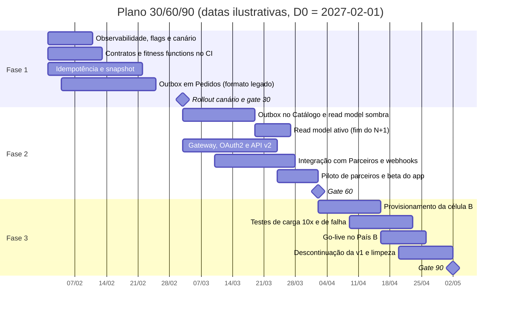

# Plano incremental 30/60/90

> Sequencia a evolução da plataforma em três fases, sem janela de indisponibilidade e sem quebrar consumidores atuais. Cada fase tem escopo, estratégia de convivência, observabilidade, rollback e um gate de saída formado pelos cenários de qualidade da fase (`02-atributos-de-qualidade.md`).
>
> Base: ADR-001 a ADR-008; `03-resiliencia.md`; controles por fase em `04-threat-model.md`; equipe em P-TIME-01.

## 1. Visão geral

| Fase | Objetivo | Resultado visível ao negócio |
|---|---|---|
| **1. Fundação segura** (dias 1 a 30) | Corrigir duplicidade, auditoria e perda de eventos sem mudar nenhum contrato | Fim de pedidos duplicados no canal web; preço vendido auditável; eventos confiáveis ao ERP |
| **2. Abertura e desacoplamento** (dias 31 a 60) | Eliminar o N+1, lançar a API v2 e as notificações a parceiros | Piloto com parceiros de marketplace e beta do app móvel |
| **3. Segundo país e escala** (dias 61 a 90) | Operar a célula B, provar a escala de 10x e iniciar a descontinuação da v1 | Operação no País B; capacidade validada para o volume projetado |

As datas são ilustrativas. Se o início coincidir com períodos de congelamento de mudanças (Black Friday, fim de ano, campanhas), as janelas de rollout precisam ser deslocadas.

## 2. Princípios de execução

1. **Toda mudança é reversível dentro da fase.** Comportamentos novos entram desligados por feature flag e são ativados gradualmente. Desligar a flag é o rollback padrão, sem novo deploy.
2. **Banco de dados em *expand and contract*.** Primeiro adiciona-se estrutura nova (tabelas, colunas anuláveis), depois o código passa a usá-la, e só depois, em fase posterior, remove-se o que ficou obsoleto. Nenhuma migração destrutiva acontece na mesma fase em que o código novo é ativado.
3. **Rollout canário.** Toda versão nova recebe 5%, depois 25% e depois 100% do tráfego, com rollback automático se a taxa de 5xx do canário passar de 1% por 5 minutos (QA-DIS-05).
4. **Modo sombra antes da troca.** Quando o novo caminho substitui um antigo de mesma função, ele roda primeiro em paralelo, sem efeito, e as divergências são medidas antes da troca.
5. **Gates por evidência.** Uma fase só termina quando os cenários de qualidade da fase passam. Datas cedem a evidências, não o contrário.

## 3. Fase 1: fundação segura (dias 1 a 30)

**Objetivo:** colocar em produção a primeira melhoria segura, como exige o enunciado, sem nenhuma mudança visível de contrato.

### Escopo

| Item | Descrição | ADR | Responsável principal |
|---|---|---|---|
| Observabilidade | OpenTelemetry com propagação de `traceparent`; métricas RED por rota; painéis dos SLIs; alertas de orçamento de erro | — | Dev C + SRE |
| Feature flags e canário | Biblioteca de flags no serviço de Pedidos; pipeline com rollout canário e rollback automático | — | Dev C + SRE |
| Contratos e CI | v1 1.1.0, linha de base, Spectral, `oasdiff`, AsyncAPI CLI, ArchUnit, SAST e análise de dependências | 007 | Dev D |
| Idempotência | Tabela `idempotency_record`; header opcional na v1; frontend web passa a enviar a chave | 005 | Dev A |
| Snapshot | Tabela de snapshots; captura a partir das chamadas atuais ao Catálogo, feitas antes da transação | 004 | Dev A |
| Outbox | Tabela `outbox_event` e publicador por polling, publicando **no tópico e no formato atuais** | 006 | Dev B |
| Segurança de base | Varredura de PII e segredos em logs; DTOs explícitos na criação | — | Dev D + QA |

### Plano semanal

| Semana | Entregas |
|---|---|
| 1 | Tracing e métricas em produção; flags disponíveis; pipeline de contratos no CI; migrações *expand* aplicadas (tabelas novas, sem uso) |
| 2 | Idempotência e snapshot implementados e testados (cenários QA-INT e QA-AUD em CI); outbox implementado; canário configurado |
| 3 | Frontend web enviando `Idempotency-Key`; idempotência e snapshot ativados por canário (5% → 25% → 100%) |
| 4 | Outbox ativado por canário, substituindo o dual write; testes de falha do broker (QA-DIS-02); gate 30 |

### Convivência

- **Idempotência:** consumidores v1 sem o header mantêm o comportamento atual. Só o frontend web adota o header nesta fase.
- **Snapshot:** grava para pedidos novos; pedidos antigos continuam sem snapshot até o backfill da fase 2. A v1 lê do snapshot quando existe e cai no comportamento atual quando não existe.
- **Outbox:** a flag decide, por transação, se o evento vai para o outbox ou para a publicação direta. Como cada pedido usa apenas um dos caminhos, não há duplicidade durante a troca. O ERP não percebe mudança, porque tópico e formato continuam os mesmos.

### Rollback

| Mudança | Gatilho | Ação | Tempo |
|---|---|---|---|
| Idempotência | Aumento de latência de criação ou de erros `409` | Desligar a flag; o header passa a ser ignorado | Minutos |
| Snapshot | Erros na gravação ou divergência de valores | Desligar a flag; v1 volta a ler do Catálogo | Minutos |
| Outbox | `outbox_publish_lag_seconds` P95 > 2 s por 15 min ou eventos faltando no ERP | Desligar a flag; volta o dual write; eventos já gravados no outbox continuam sendo publicados | Minutos |
| Versão do serviço | Taxa de 5xx do canário > 1% por 5 min | Rollback automático do canário | Automático |

### Gate de saída

QA-DIS-02, QA-DIS-05, QA-INT-01 a QA-INT-04, QA-SEG-06, QA-PRI-01, QA-PRI-02, QA-AUD-01, QA-COM-01 a QA-COM-03. Além disso, 7 dias com idempotência, snapshot e outbox a 100% sem incidentes atribuídos.

## 4. Fase 2: abertura e desacoplamento (dias 31 a 60)

**Objetivo:** tirar o Catálogo do caminho crítico, abrir a API v2 para app e parceiros e entregar notificações assíncronas.

### Escopo

| Item | Descrição | ADR |
|---|---|---|
| Outbox no Catálogo | Publicação de `CatalogItemChanged` | 003, 006 |
| Read model de catálogo | Carga inicial, consumidor, reconciliação diária; modo sombra seguido de ativação | 003 |
| API Gateway regional | Validação de token, quotas por chamador, rotas `/orders`, `/v1` e `/v2` | 002, 007 |
| API v2 | Criação, consulta e listagem com Problem Details; `Idempotency-Key` obrigatória | 005, 007 |
| Identidade de parceiros | OAuth2 *client credentials* com escopos; PKCE para o app | — |
| Novo tópico de eventos | `orders.events` (contrato AsyncAPI) publicado em paralelo ao tópico atual | 006, 007 |
| Integração com Parceiros | Novo serviço; assinaturas, webhooks com HMAC, retry, circuit breaker e DLQ; proteção contra SSRF | 001, 008 |
| Backfill de snapshots | Job fora do pico, marcando pedidos antigos como `RECONSTRUCTED` | 004 |
| Java 21 e Spring Boot 4 | Atualização de runtime e framework de Pedidos e Catálogo (a linha 3.x do Spring Boot está sem suporte OSS desde junho de 2026), em release própria, antes das demais entregas da fase | — |

### Convivência

- **Read model em modo sombra:** durante cerca de duas semanas, Pedidos continua precificando pelas chamadas ao Catálogo e, em paralelo, calcula o preço pelo read model sem usá-lo. A métrica de divergência entre os dois precisa ficar abaixo de 0,1% (explicada pelo atraso de propagação) antes da troca. A troca é feita por flag, por canário. O caminho síncrono antigo permanece no código, desligado, até a fase 3.
- **Dois tópicos de eventos:** o tópico atual continua sendo alimentado pelo outbox no formato legado, e o novo `orders.events` recebe o formato do contrato AsyncAPI. O ERP migra quando puder, dentro da janela de 6 meses.
- **v1 e v2 lado a lado:** a v1 continua sem nenhuma mudança de comportamento; a v2 é aberta primeiro para o app em beta e para 1 ou 2 parceiros piloto.
- **Webhooks em piloto:** apenas os parceiros piloto têm assinaturas ativas; os demais continuam como hoje.

### Rollback

| Mudança | Gatilho | Ação |
|---|---|---|
| Read model ativo | Divergência de preço > 0,1% ou aumento de `409 price-changed` | Flag volta a precificar pelo Catálogo síncrono |
| API v2 | Erros ou latência fora do SLO | Gateway retira a rota `/v2`; app beta e parceiros piloto voltam a aguardar; v1 não é afetada |
| Webhooks | Falhas de entrega generalizadas | Pausar entregas por parceiro ou globalmente; parceiros usam a reconciliação |
| Gateway | Falha de roteamento | DNS volta a apontar para o balanceador anterior, que continua ativo durante a fase |

### Gate de saída

Cenários com fase 60 em `02-atributos-de-qualidade.md`, incluindo QA-DIS-01, QA-DIS-03, QA-DES-01 a QA-DES-04, QA-INT-05, QA-INT-06, QA-SEG-01, QA-SEG-03 a QA-SEG-05 e QA-REC-02 a QA-REC-04. Além disso, ao menos um parceiro piloto recebendo webhooks em produção por 7 dias.

## 5. Fase 3: segundo país e escala (dias 61 a 90)

**Objetivo:** operar no País B com dados residentes, comprovar a capacidade para 10x e iniciar a saída dos componentes legados.

### Escopo

| Item | Descrição | ADR |
|---|---|---|
| Célula B | Provisionamento por IaC com os mesmos artefatos da célula BR, sem v1; políticas de IaC por região | 002 |
| Replicação de catálogo | Eventos do País B replicados para o broker da célula B; carga inicial do read model | 002, 003 |
| Roteamento regional | Hostname `api-b`; verificação da claim `country` nos dois gateways | 002 |
| Testes de escala e falha | Carga a 260 pedidos/s e 2.000 consultas/s; failover de banco; perda da região Brasil | — |
| Descontinuação da v1 | Headers `Deprecation` e `Sunset`; comunicação aos consumidores conhecidos; painel de tráfego por `client_id` | 007 |
| Remoção de código legado | Caminho síncrono N+1 e publicação direta (dual write), desligados desde as fases anteriores | 003, 006 |
| Privacidade | Fluxo de anonimização para solicitações de titulares | — |

### Convivência

- **Célula B nasce isolada:** nenhum dado pessoal existente precisa ser migrado, porque não há operação anterior no País B. O go-live começa com tráfego interno de teste, depois com um parceiro e o app, e só então com abertura geral.
- **v1 continua funcionando** durante toda a descontinuação; apenas passa a anunciar a data de desligamento.

### Rollback

| Mudança | Gatilho | Ação |
|---|---|---|
| Go-live no País B | Falha grave na célula B | Suspender o hostname `api-b`; a célula BR não é afetada, por desenho |
| Remoção de código legado | Problema descoberto após a remoção | Reverter o commit de remoção; o código estava desligado e coberto por testes até a remoção |

### Gate de saída

Cenários com fase 90, incluindo QA-ESC-01, QA-ESC-02, QA-ESC-04, QA-DIS-04, QA-DIS-06, QA-SEG-02, QA-PRI-03, QA-PRI-04 e QA-REC-01. Além disso, 7 dias de operação no País B dentro dos SLOs.

## 6. Observabilidade por fase

| Fase | O que passa a existir | Para que serve no plano |
|---|---|---|
| 1 | Tracing distribuído; métricas RED; SLIs de disponibilidade e latência; `idempotent_replay_total`; `outbox_pending_count` e `outbox_publish_lag_seconds`; alertas de orçamento de erro | Decidir os passos do canário e acionar rollbacks |
| 2 | `catalog_view_lag_seconds`; métrica de divergência do modo sombra; `circuit_breaker_state`; métricas de webhook por parceiro; tráfego por versão e `client_id` no gateway | Decidir a troca do read model; acompanhar o piloto de parceiros |
| 3 | Painéis por célula; SLOs separados por país; painel de consumidores restantes da v1 | Go-live da célula B; condução da descontinuação |

## 7. Descomissionamento

| Item | Quando é desligado | Quando é removido | Condição de remoção |
|---|---|---|---|
| Publicação direta (dual write) | Fase 1 | Fase 3 | 30 dias com a flag desligada sem incidentes |
| Caminho síncrono N+1 para o Catálogo | Fase 2 | Fase 3 | 14 dias com o read model ativo sem rollback |
| Balanceador anterior ao gateway | Fase 2 | Fase 3 | Todo o tráfego passando pelo gateway |
| Tópico de eventos legado | Após a migração do ERP | Mínimo de 6 meses após o novo tópico | Nenhum consumidor ativo por 30 dias |
| API v1 e adaptador | Após a fase 3 | Mínimo de 6 meses após o lançamento da v2 | 30 dias consecutivos sem tráfego (ADR-007) |
| Coluna `legacyId` | Junto com a v1 | Após a remoção da v1 | Migração *contract* em release separada |

Os três últimos itens acontecem depois dos 90 dias, por exigência da janela de compatibilidade de 6 meses.

## 8. Depois dos 90 dias

| Item | Gatilho ou data |
|---|---|
| Desligamento da API v1 e do tópico legado | A partir do mês 8 (6 meses após o lançamento da v2, no dia 60), condicionado a tráfego zero |
| Assistente Operacional | Piloto interno após a estabilização da célula B |
| Migração do outbox para CDC | Somente se os gatilhos do ADR-006 forem atingidos |
| Cotação de preço com validade | Somente se a questão Q-08 confirmar a necessidade |

## 9. Dependências críticas do cronograma

| Dependência | Prazo limite | Efeito se atrasar |
|---|---|---|
| Confirmação do broker existente (Q-05) | Dia 3 | Provisionar o broker entra na fase 1 e consome a folga |
| Definição do País B e de seus requisitos (Q-01) | Dia 30 | A célula B não pode ser desenhada em detalhe; fase 3 atrasa |
| Disponibilidade de região de nuvem no País B (Q-06) | Dia 30 | Revisão do ADR-002; fase 3 atrasa de forma significativa |
| Parceiros piloto com ambiente de testes | Dia 40 | Piloto de webhooks desliza para a fase 3 |
| Lista de consumidores da v1 (Q-04) | Dia 60 | Descontinuação comunicada a públicos incompletos |
| Ampliação da equipe para as fases 2 e 3 (Q-11) | Dia 25 | As fases 2 e 3 têm escopo maior que a fase 1; com a equipe da fase 1, o escopo precisa ser reduzido |

## 10. Governança do plano

- **Gate de fase:** reunião de go/no-go com produto, arquitetura, SRE e segurança, a partir do resultado automatizado dos cenários do gate.
- **Ritmo:** acompanhamento semanal dos SLIs e do orçamento de erro; replanejamento ao fim de cada fase.
- **Corte de escopo:** quando necessário, a ordem de corte é definida antes, para proteger os objetivos centrais. Na fase 2, o piloto de parceiros vem antes do app; na fase 3, o go-live do País B vem antes da limpeza de código legado.
