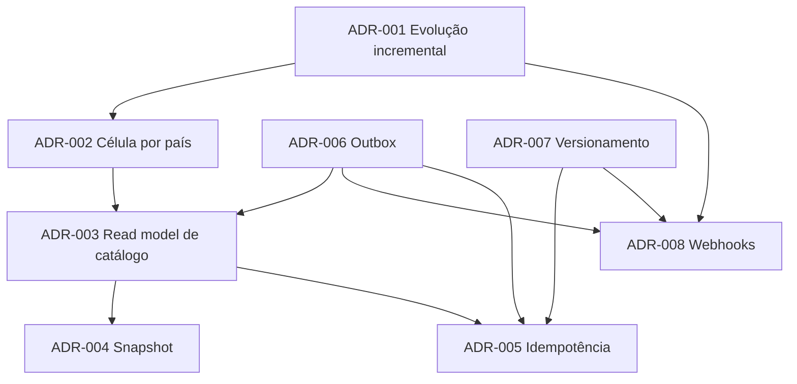

# Architecture Decision Records

Registro das decisões arquiteturais da evolução da plataforma de Pedidos e Catálogo. Formato baseado no MADR, com uma seção obrigatória de **Validação** que liga cada decisão a testes, fitness functions ou métricas.

## Índice

| ADR | Título | Status | Problema do enunciado que resolve |
|---|---|---|---|
| [ADR-001](ADR-001-evolucao-incremental-sobre-servicos-existentes.md) | Evolução incremental sobre os serviços existentes | Proposto | Prazo de 30/90 dias sem superdimensionar |
| [ADR-002](ADR-002-celula-por-pais-para-residencia-de-dados.md) | Célula por país para residência de dados | Proposto | LGPD e residência no segundo país |
| [ADR-003](ADR-003-read-model-local-de-catalogo.md) | Read model local de Catálogo em Pedidos | Proposto | Padrão N+1 síncrono |
| [ADR-004](ADR-004-snapshot-de-item-do-pedido.md) | Snapshot de preço e descrição no item | Proposto | Falta de snapshot para auditoria |
| [ADR-005](ADR-005-idempotencia-na-criacao-de-pedido.md) | Idempotência na criação de pedido | Proposto | Retries sem chave de idempotência |
| [ADR-006](ADR-006-transactional-outbox.md) | Transactional outbox | Proposto | Eventos sem garantia transacional |
| [ADR-007](ADR-007-versionamento-de-api-e-compatibilidade.md) | Versionamento da API e compatibilidade | Proposto | API versionada e contratos por 6 meses |
| [ADR-008](ADR-008-notificacao-a-parceiros-por-webhooks.md) | Notificação a parceiros por webhooks | Proposto | Notificações assíncronas para parceiros |

**Provados na PoC:** ADR-005 (idempotência, inclusive concorrente) e ADR-007 (compatibilidade v1 com consumidor existente).

## Dependências entre decisões



## Ciclo de vida

`Proposto` → `Aceito` → (`Substituído por ADR-nnn` ou `Descontinuado`). ADRs aceitos não são editados no conteúdo da decisão; mudanças geram novo ADR que substitui o anterior.

## Template

```markdown
# ADR-nnn: Título no imperativo ou como decisão

- **Status:** Proposto | Aceito | Substituído por ADR-nnn | Descontinuado
- **Data:** AAAA-MM-DD
- **Decisores:**
- **Relacionados:**

## Contexto
Problema, forças em jogo e referências às premissas (P-xxx) e cálculos (C-xx).

## Drivers
Critérios que decidem entre as alternativas.

## Alternativas consideradas
Pelo menos duas alternativas reais, cada uma com prós e contras.

## Decisão
O que foi decidido, com detalhe suficiente para implementar.

## Consequências
Positivas e negativas, incluindo riscos e débitos aceitos.

## Validação
Testes, fitness functions ou métricas que mostram que a decisão está funcionando.
```

O CI verifica que todo arquivo `ADR-*.md` contém as seções Status, Contexto, Alternativas consideradas, Decisão, Consequências e Validação.
