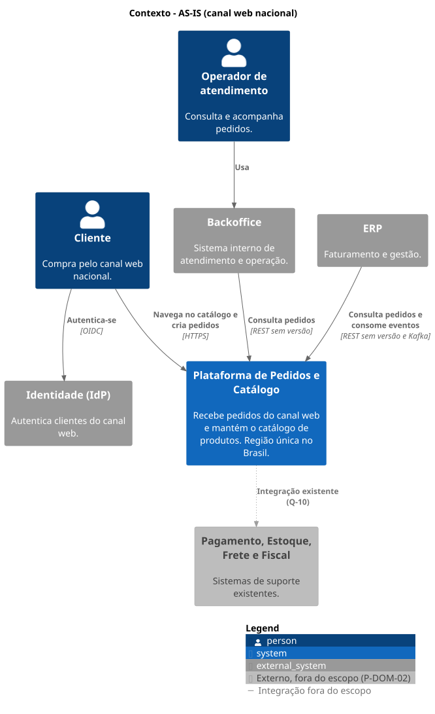
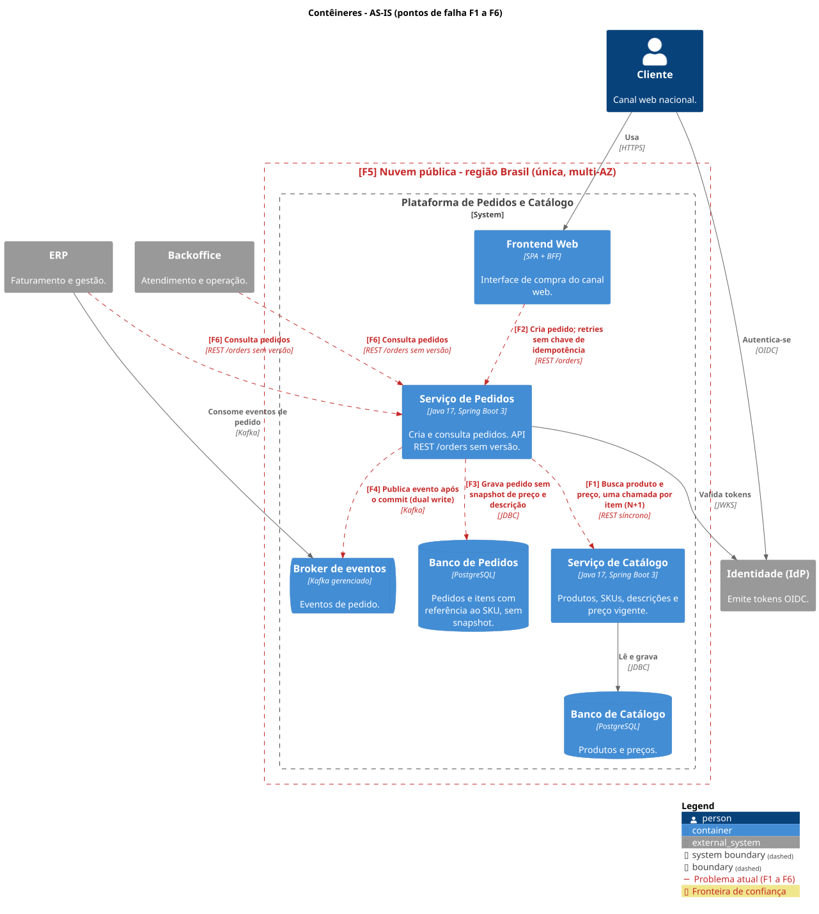
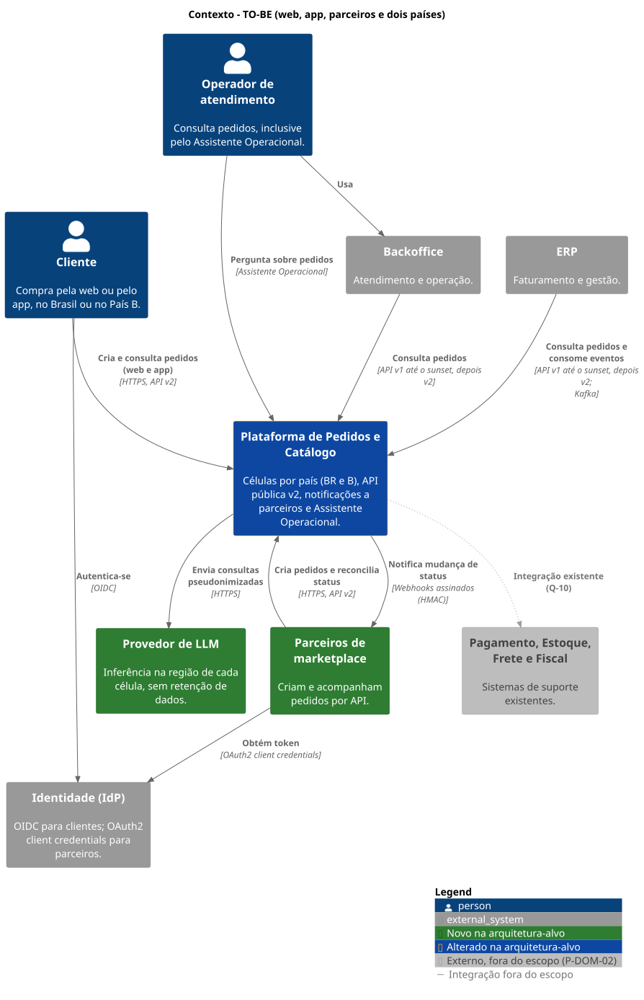
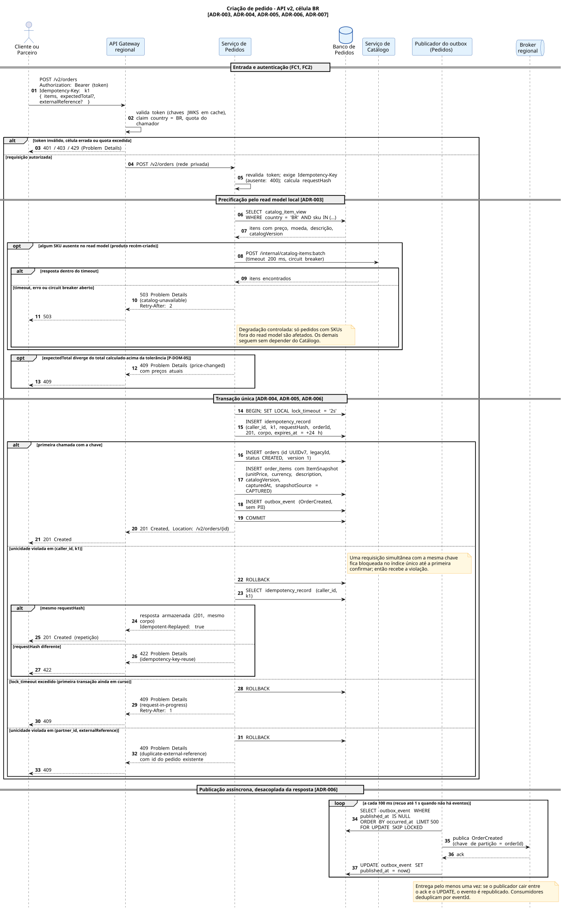
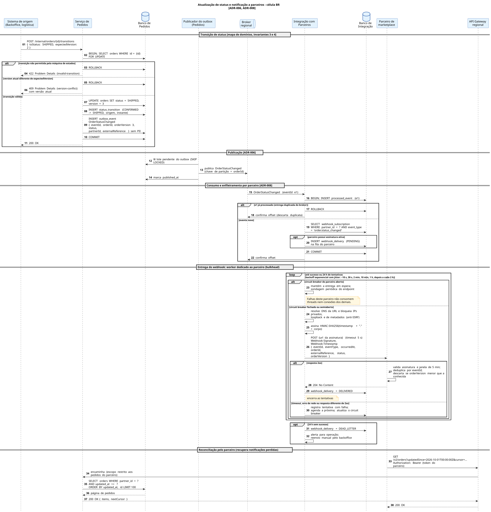
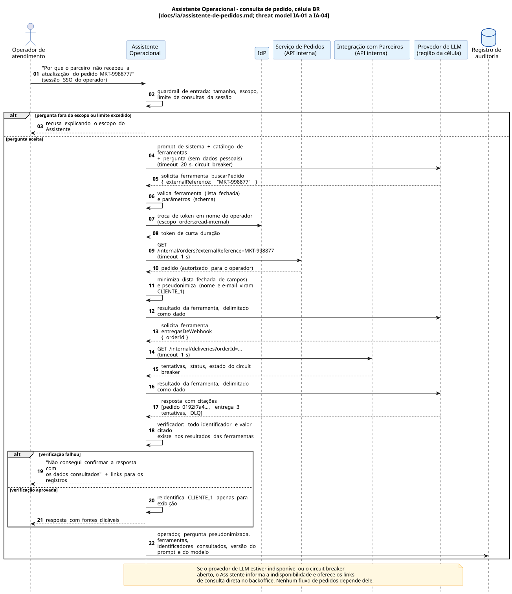

# Visões arquiteturais

Diagramas como código em C4-PlantUML (contexto e contêineres) e PlantUML (sequência). Os SVGs são gerados pelo CI a cada push em `main`; para gerar localmente, execute `./scripts/render-diagramas.sh` (requer Java 17+ e Graphviz).

Os termos seguem o [mapa de domínios](../01-mapa-de-dominios.md) e as decisões estão nos [ADRs](../adr/README.md).

## Índice

| Visão | AS-IS | TO-BE |
|---|---|---|
| Contexto (C4 nível 1) | [fonte](c4/c4-contexto-as-is.puml) | [fonte](c4/c4-contexto-to-be.puml) |
| Contêineres (C4 nível 2) | [fonte](c4/c4-conteineres-as-is.puml) | [fonte](c4/c4-conteineres-to-be.puml) |
| Sequência: criação de pedido | — | [fonte](sequencia/seq-criacao-de-pedido.puml) |
| Sequência: atualização e notificação de status | — | [fonte](sequencia/seq-atualizacao-e-notificacao-de-status.puml) |
| Sequência: consulta pelo Assistente Operacional | — | [fonte](sequencia/seq-assistente-operacional.puml) |

### Contexto AS-IS

### Contêineres AS-IS

### Contexto TO-BE

### Contêineres TO-BE

**Convenções visuais:** verde indica contêiner novo; azul escuro com borda amarela, contêiner alterado; cinza, sistema fora do escopo. Setas vermelhas tracejadas marcam problemas atuais; setas pontilhadas marrons, caminhos de contingência. Bordas vermelhas tracejadas são fronteiras de confiança; bordas roxas espessas são células (fronteira de confiança e de residência de dados).

**Simplificação deliberada:** o diagrama de contêineres TO-BE detalha apenas a célula BR. A célula B executa os mesmos artefatos, sem a API v1, e aparece como um único elemento para manter o diagrama legível.

### Sequência: criação de pedido
Cobre autenticação no gateway, precificação pelo read model, contingência do Catálogo, todos os desfechos de idempotência (primeira chamada, repetição, corpo diferente, concorrência, referência externa duplicada) e a publicação assíncrona pelo outbox.

### Sequência: atualização e notificação de status
Cobre a transição com controle otimista de versão, publicação pelo outbox, deduplicação no consumidor, entrega de webhook com bulkhead, circuit breaker, retry com backoff e DLQ, e a reconciliação pelo parceiro.

### Sequência: consulta pelo Assistente Operacional
Cobre guardrails de entrada, ferramentas somente leitura em nome do operador, pseudonimização antes do modelo, verificação das citações e registro de auditoria ([proposta completa](../ia/assistente-de-pedidos.md)).

## Pontos de falha do estado atual

| ID | Ponto de falha | Efeito | Resolvido por |
|---|---|---|---|
| F1 | Pedidos chama o Catálogo uma vez por item, de forma síncrona | Latência proporcional ao número de itens; falha ou lentidão do Catálogo derruba a criação de pedidos (efeito cascata) | ADR-003 |
| F2 | Criação de pedido sem chave de idempotência | Pedidos duplicados em retries | ADR-005 |
| F3 | Itens sem snapshot | Impossível auditar preço e descrição vendidos | ADR-004 |
| F4 | Publicação de evento fora da transação (dual write) | Eventos perdidos ou sem pedido correspondente | ADR-006 |
| F5 | Região única | Indisponibilidade regional para toda a operação; impede residência de dados no País B | ADR-002 |
| F6 | API sem versão | Qualquer mudança de contrato pode quebrar consumidores | ADR-007 |

## Pontos de falha residuais da arquitetura-alvo

| Componente | Se falhar | Mitigação | Efeito no SLO |
|---|---|---|---|
| API Gateway regional | Célula sem entrada de tráfego | Serviço gerenciado multi-AZ | Consome orçamento de erro da célula |
| Banco de Pedidos | Célula não cria nem consulta pedidos | Multi-AZ com failover automático; RPO ≤ 5 min, RTO ≤ 30 min (P-SLO-06) | Consome orçamento de erro |
| Broker regional | Eventos não são publicados | Outbox acumula; criação de pedidos continua; notificações atrasam | Afeta apenas P-SLO-04 |
| Serviço de Catálogo ou replicação | Read model fica desatualizado | Criação continua com o último preço conhecido; SKUs novos são rejeitados após o circuit breaker abrir | Sem efeito na criação de SKUs conhecidos |
| Integração com Parceiros | Notificações atrasam | Eventos ficam retidos no broker; reprocessamento ao voltar | Afeta apenas P-SLO-04 |
| Endpoint de um parceiro | Entregas para esse parceiro falham | Bulkhead e circuit breaker por parceiro; retry por 24 h; DLQ | Nenhum para os demais parceiros |
| IdP | Novos tokens não são emitidos | Tokens já emitidos continuam válidos; chaves públicas em cache no gateway | Novos logins falham; fora do controle da plataforma |
| Provedor de LLM | Assistente indisponível | Sem dependência do núcleo; operador usa o backoffice | Nenhum |
| Região inteira | Perda da célula | Restauração em outra zona ou região a partir de backups; RTO ≤ 4 h | Risco aceito; afeta apenas o país da célula |

## Fronteiras de confiança

As mesmas fronteiras são a base do threat model (`../04-threat-model.md`).

| ID | Fronteira | Quem cruza | Controles |
|---|---|---|---|
| FC1 | Internet → API Gateway regional | Clientes web e app | TLS, token OIDC, verificação da claim `country`, rate limit por cliente |
| FC2 | Internet → API Gateway regional | Parceiros | OAuth2 *client credentials*, escopos, quotas por parceiro, acesso restrito aos próprios pedidos |
| FC3 | Gateway → serviços internos | Requisições autenticadas | Rede privada; serviços revalidam o token e aplicam autorização por recurso |
| FC4 | Célula → fora da célula | Nenhum dado pessoal | Apenas métricas agregadas saem; somente eventos de catálogo entram (ADR-002) |
| FC5 | Integração com Parceiros → parceiro | Webhooks | Assinatura HMAC com timestamp, payload sem PII, bloqueio de destinos privados (SSRF) |
| FC6 | Assistente Operacional → provedor de LLM | Consultas | Pseudonimização, provedor na região da célula, contrato sem retenção |
| FC7 | Catálogo central → células | Eventos de catálogo | Schema sem campos de PII verificado no CI; replicação autenticada |

## Dependências externas

| Sistema | Usado por | Tipo de dependência | Comportamento em falha |
|---|---|---|---|
| Identidade (IdP) | Gateway, clientes, parceiros | Síncrona apenas na obtenção de token | Ver tabela de pontos de falha |
| Backoffice | Operadores | Consumidor das APIs v1 e v2 | Sem impacto na plataforma |
| ERP | Faturamento | Consumidor da API e de eventos | Eventos retidos no broker |
| Parceiros de marketplace | Integração com Parceiros | Destino de webhooks | Isolado por parceiro |
| Provedor de LLM | Assistente Operacional | Síncrona, fora do núcleo | Assistente indisponível |
| Pagamento, Estoque, Frete, Fiscal | — | Fora do escopo (P-DOM-02, Q-10) | A definir |
